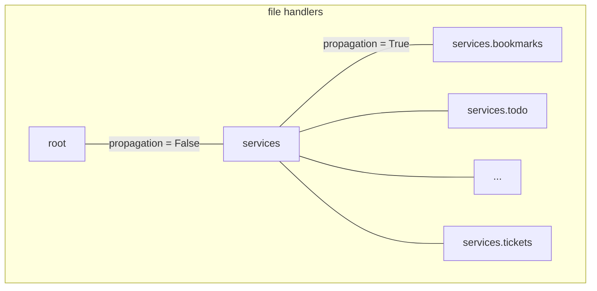

# Logging
## Using

### to log information
```python
from tshared.utils.setup_logger import log_for

if successfuly_executed():
    log_for(self).info('User successfully did smth.')
    # in file_name.log
    # 2022-06-14 10:16:58,217 - services.base        - INFO    - special message from the base.
else:
    raise Exception('Something happend!')
```

### to log exception
```python
from tshared.utils.setup_logger import log_for

try:
    some_function()
except Exception as e:
    log_for(self).error(e)
    # in file_name.log
    # 2022-06-14 10:16:58,217 - services.base        - ERROR    - special message from the base.
```

### supported levels
```python
from tshared.utils.setup_logger import log_for

# works only from debugger
log_for('').debug('message')

log_for('').info('message')
log_for('').warning('message')

log_for('').error('message')
log_for('').critical('message')

```

## hierarchy of loggers



On the scheme above you can see that `root` logger is highest logger in logging hierarchy.  
Also name of a logger determines relationship between loggers. For example `services` is a parent logger for `services.bookmarks` logger. Relationship 

### Handlers levels
Handlers are objects that process loggers messages.


Pseudo code for understanding logging levels:
```python
if (log_message.level >= logger.level
    and log_message.level >= logger.handler.level):

    logger.handler.log(log_message.text)
else:
    do_nothing()
```

Int description of levels from python logging module
```python
CRITICAL = 50
ERROR = 40
WARNING = 30
INFO = 20
DEBUG = 10
NOTSET = 0
```

Also `level` is characteristic that determines how far by hierarchy of loggers a message can reach.


#### Current loggers handlers configuration
##### Normal mode
| handler \ | root    | services | services.service_name |
|-----------|---------|----------|-----------------------|
| console   | warning | info     | no handler            |
| file      | warning | error    | warning               |

##### Debug mode
| handler \ | root    | services | services.service_name |
|-----------|---------|----------|-----------------------|
| console   | debug   | debug    | --//--                |
| file      | --//--  | --//--   | --//--                |
